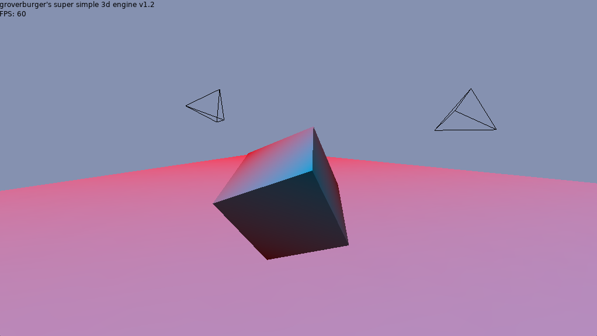

# Super Simple 3D Engine v1.3

groverburger's Super Simple 3D Engine (SS3D) is my take on simplifying LÖVE 11's new 3D capabilities into a ready-to-use library for simple 3D games.



### Features:
- Built in first person camera controls
- Engine encapsulated into a single file
- Readable and commented code
- 2D rendering / HUD support
- Rotatable and translatable models
- UV mapping
- Backface culling (enabled on a per-model basis)
- Wireframe rendering (enabled on a per-model basis)
- Simple directional ambient lighting

### To Dos
- Phong lighting
- Simple collision handling (coming next, probably!)
- More detailed documentation

### Installation
Drag the engine.lua file into your project directory to install. SS3D does require CPML, which can be found [here](https://github.com/excessive/cpml). I've included the latest version of CPML which I have confirmed works without problems in this repository.

### Basic Usage
Import a reference to the engine before love.load.
```lua
Engine = require "ss3d"
```
In love.load create a new Scene object to start using 3D.
The two arguments refer to the output width and height in pixels of the Scene's camera.
It's also recommended to set the mouse's relative mode to true, especially for first-person cameras.
It would also be useful to define an image to be used as a texture when creating a model, therefore `Texture` will be defined in this example.
```lua
love.mouse.setRelativeMode(true)
Texture = love.graphics.newImage("texture.png")
Scene = Engine.newScene(love.graphics.getWidth(), love.graphics.getHeight())
```
Models can either be created via tables containing point definitions or importing .obj model files.

Point definitions can be expressed as follows:
```lua
-- define a tetrahedron model
local tetrahedron = {
    {-1,-1,-1},
    {-1,1,1},
    {1,1,-1},

    {-1,1,1},
    {1,1,-1},
    {1,-1,1},

    {-1,-1,-1},
    {1,1,-1},
    {1,-1,1},

    {-1,-1,-1},
    {-1,1,1},
    {1,-1,1},
}
```
Each table inside the model defines a point in the model, with the indices being the x, y, and z coordinates respectively. Points can also optionally take in fourth and fifth indices, representing the u and v coordinates for a given texture. Every three points creates one triangle, and these triangles are used to build models.

Point definitions can also be imported from .obj files, and can then be easily passed to an argument in newModel like so:
```lua
AlakazamModel = Engine.newModel(Engine.loadObj("alakazam.obj"), Texture)
```

Once the vertices for a model have been defined, the model can now be instantiated and added to a Scene.
An argument for a texture is optional. A texture is just a standard image created with love.graphics.newImage(). If left blank, it will default to pure black.
```lua
TetrahedronModel = Engine.newModel(tetrahedron, Texture)
Scene:addModel(TetrahedronModel)
```

Models can be translated and rotated with the setTransform function like so:
```lua
TetrahedronModel:setTransform({0,0,-1}, {0, cpml.vec3.unit_x, 1, cpml.vec3.unit_y, 2, cpml.vec3.unit_z})
```
The first argument represents a translation, and sets the model's x, y, and z coordinates to the given table. The optional second argument represents a rotation, and rotates the model to the given angles in radians relative to the corresponding axis.

The scene can be rendered with the function Scene:render() in love.draw like so:
```lua
function love.draw()
    Scene:render()
end
```

Some basic first-person mouse look can also be added with only one function like so:
```lua
function love.mousemoved(x,y, dx,dy)
    Scene:mouseLook(x,y, dx,dy)
end
```

That's the basics!
The given main.lua runs the demo provided with SS3D and provides a useful code example.
I might also respond to things on the main thread (albeit very slowly)
https://love2d.org/forums/viewtopic.php?f=5&t=86350

This code is offered under the MIT license, so feel free to use this engine in whatever you want. No credit necessary.
