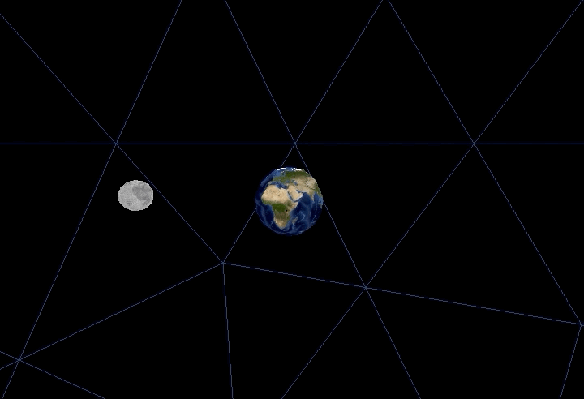

groverburger's 3D engine (g3d) simplifies [LÖVE](http://love2d.org)'s 3d capabilities to be as simple to use as possible.<br/>
View the original forum post [here](https://love2d.org/forums/viewtopic.php?f=5&t=86350).



The entire `main.lua` file for the Earth and Moon demo is under 30 lines, as shown here:
```lua
-- written by groverbuger for g3d
-- may 2021
-- MIT license

local g3d = require "g3d"
local earth = g3d.newModel("assets/sphere.obj", "assets/earth.png", {0,0,4})
local moon = g3d.newModel("assets/sphere.obj", "assets/moon.png", {5,0,4}, nil, {0.5,0.5,0.5})
local background = g3d.newModel("assets/sphere.obj", "assets/starfield.png", {0,0,0}, nil, {500,500,500})
local timer = 0

function love.mousemoved(x,y, dx,dy)
    g3d.camera.firstPersonLook(dx,dy)
end

function love.update(dt)
    timer = timer + dt
    moon:setTranslation(math.cos(timer)*5, 0, math.sin(timer)*5 +4)
    moon:setRotation(0, math.pi - timer, 0)
    g3d.camera.firstPersonMovement(dt)
    if love.keyboard.isDown("escape") then love.event.push("quit") end
end

function love.draw()
    earth:draw()
    moon:draw()
    background:draw()
end
```

## Features

- 3D Model rendering
- .obj file loading
- Basic first person movement and camera controls
- Perspective and orthographic projections
- Easily create your own custom vertex and fragment shaders
- Basic collision functions
- Simple, commented, and organized
- Fully documented, check out the [g3d wiki](https://github.com/groverburger/g3d/wiki)!

## Getting Started

1. Download the latest release version.
2. Add the `g3d` subfolder folder to your project.
3. Add `g3d = require "g3d"` to the top of your `main.lua` file.

For more information, check out the [g3d wiki](https://github.com/groverburger/g3d/wiki)!

## Games and demos made with g3d

[Hoarder's Horrible House of Stuff](https://alesan99.itch.io/hoarders-horrible-house-of-stuff) by alesan99<br/>


[Lead Haul](https://hydrogen-maniac.itch.io/lead-haul) by YouDoYouBuddy<br/>


[First Person Test](https://github.com/groverburger/g3d_fps) by groverburger<br/>


[g3d voxel engine](https://github.com/groverburger/g3d_voxel) by groverburger<br />


## Additional Help and FAQ 

Check out the [g3d wiki](https://github.com/groverburger/g3d/wiki)!
