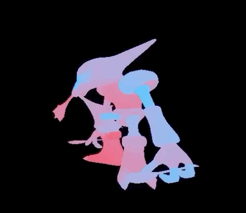

# G3D

groverburger's 3D engine (g3d) simplifies love2d's 3d capabilities to be as simple as possible.



### Features:
- 3D Model rendering
- .obj file loading
- Simple collision handling

### Installation
Add the g3d folder to your project.

### Usage

The entire main.lua file for the demo shown is 21 lines, as shown here:
```lua
-- written by groverbuger
-- august 2020
-- MIT license

require "g3d"

function love.load()
    Texture = love.graphics.newImage("assets/texture.png")
    Alakazam = Model:new("assets/alakazam.obj", Texture)
    Alakazam:setTranslation(0,-2,5)
    Timer = 0
end

function love.update(dt)
    Timer = Timer + dt
    Alakazam:setRotation(0,Timer,0)
end

function love.draw()
    Alakazam:draw()
end
```

- create a model with Model:new(obj, texture) passing in the .obj and texture
- translate and rotate the model with Model:setTranslation(x,y,z) and Model:setRotation(x,y,z)
- move and rotate the camera with SetCamera(x,y,z, direction,pitch) or SetCameraAndLookAt(x,y,z, xAt,yAt,zAt)

For more information, check out the model.lua and camera.lua files.
The code is commented and designed to be readable.
