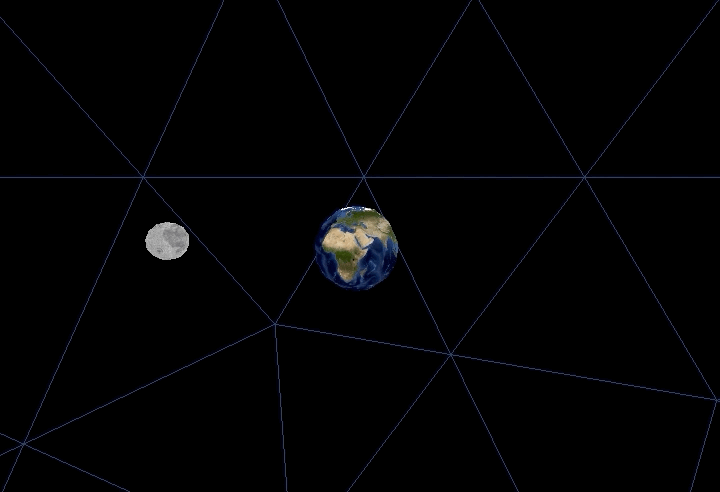

groverburger's 3D engine (g3d) simplifies [LÖVE](http://love2d.org)'s 3d capabilities to be as simple to use as possible.



## Getting Started

1. Download the latest release version.
2. Add the `g3d` folder to your LÖVE project.
3. Add `local g3d = require "g3d"` to your `main.lua` file.

The entire `main.lua` file for the Earth and Moon demo is under 30 lines:

```lua
local g3d = require "g3d"
local earth = g3d.newModel("assets/sphere.obj", "assets/earth.png", {4,0,0})
local moon = g3d.newModel("assets/sphere.obj", "assets/moon.png", {4,5,0}, nil, 0.5)
local background = g3d.newModel("assets/sphere.obj", "assets/starfield.png", nil, nil, 500)
local timer = 0

function love.update(dt)
    timer = timer + dt
    moon:setTranslation(math.cos(timer)*5 + 4, math.sin(timer)*5, 0)
    moon:setRotation(0, 0, timer - math.pi/2)
    g3d.camera.firstPersonMovement(dt)
    if love.keyboard.isDown "escape" then
        love.event.push "quit"
    end
end

function love.draw()
    earth:draw()
    moon:draw()
    background:draw()
end

function love.mousemoved(x,y, dx,dy)
    g3d.camera.firstPersonLook(dx,dy)
end
```

## Features

- Textured 3D model rendering
- OBJ file loading
- Perspective and orthographic cameras
- Custom vertex and fragment shader support
- Basic first-person movement and camera controls
- Lightweight collision queries
- Simple, commented, and organized

## Documentation

The [g3d wiki](https://github.com/groverburger/g3d/wiki) explains the camera, models, custom shaders, collisions, and other topics in more detail. The [original forum post](https://love2d.org/forums/viewtopic.php?f=5&t=86350) has more project history and discussion.

## Games and demos made with g3d

[Hoarder's Horrible House of Stuff](https://alesan99.itch.io/hoarders-horrible-house-of-stuff) by alesan99<br/>


[Lead Haul](https://hydrogen-maniac.itch.io/lead-haul) by YouDoYouBuddy<br/>


[Plan Meow](https://sacemakesgame.itch.io/plan-meow) by SaceMakesGame


[First Person Test](https://github.com/groverburger/g3d_fps) by groverburger<br/>


[g3d voxel engine](https://github.com/groverburger/g3d_voxel) by groverburger<br />

